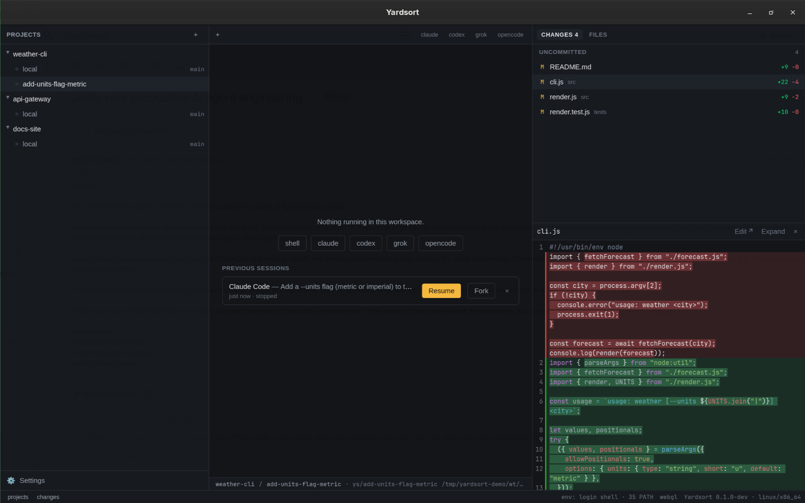

# Terminals & sessions

The middle of the window is a real terminal. Agents run in it exactly as they do anywhere else —
Yardsort does not re-implement their interface or read their output.

## Tabs

Each workspace has its own row of tabs.

- The agent buttons on the right of the tab bar start that agent in this workspace, with no
  prompt. (To start one _with_ a prompt and a fresh branch, use the [composer](workspaces.md).)
- **+** or `Ctrl+Shift+T` / `⌘T` opens a **shell** in the workspace folder — for running tests, a
  dev server, or git by hand, next to the agent.
- **×** or `Ctrl+Shift+W` / `⌘W` closes a tab and stops what runs in it.

Clicking a workspace that has nothing running — and no earlier conversations — opens a shell
there, so choosing a workspace always lands you somewhere useful.

Terminals keep running when you look elsewhere. Switch workspaces or tabs freely; when you come
back the screen is repainted exactly as it was, scrollback included.

### Copy, paste, links

|                    | Linux / Windows | macOS     |
| ------------------ | --------------- | --------- |
| Copy the selection | `Ctrl+Shift+C`  | `⌘C`      |
| Paste              | `Ctrl+Shift+V`  | `⌘V`      |
| Open a link        | `Ctrl`+click    | `⌘`+click |

Plain `Ctrl+C`, `Ctrl+V` and a plain click belong to the program in the terminal. See
[Keyboard shortcuts](shortcuts.md) for why.

## Status dots

The dot on a tab, and the one on each workspace in the sidebar, tell you what is going on without
opening anything:

| Dot            | Meaning                                                                  |
| -------------- | ------------------------------------------------------------------------ |
| **pulsing**    | printing right now — an agent at work                                    |
| **solid**      | running but quiet for a few seconds — most likely waiting for you        |
| **ringed**     | an agent finished a long stretch of work that you have not looked at yet |
| **grey**       | nothing running                                                          |
| **red** (tabs) | the program exited with an error                                         |

This comes purely from terminal activity. Agents animate a spinner while they think, so for them
silence really does mean "your turn".

## Notifications

When an agent has been busy for a while (eight seconds or more), goes quiet, and Yardsort is
**not** the window you are looking at, you get a desktop notification: _"claude is waiting —
project / workspace"_. Shells never notify, and neither does anything you are watching.

Turn it off in [Settings → General](settings.md#general).

## Sessions: resume and fork

Agents save their conversations on disk. Yardsort keeps a **record** of each one — which agent,
which conversation, your first message as its title — so you can return to it after the process
is gone: because you closed the tab, the agent exited, or you quit Yardsort.

### Resume

Same conversation, new process.

- A workspace with nothing running lists its **previous sessions**. Press **Resume** on one.
- A tab whose agent has ended shows a bar with **Resume**; the dead terminal is replaced.

After restarting Yardsort nothing is started for you — you choose what to bring back. Sessions
that were running when Yardsort closed are labelled _interrupted_; they resume like any other.

### Fork

A **copy** of the conversation that goes its own way, in a new tab. The original is untouched.
Use it to try a different approach without losing the first. You can fork an ended session from
the list or the bar, and a running one by right-clicking its tab.

### Forget

**×** on a previous session removes it from Yardsort's list. The agent's own saved conversation
is not touched.

### What can be resumed

| Agent             | Resume / fork                                                                                                                                                                                                                                      |
| ----------------- | -------------------------------------------------------------------------------------------------------------------------------------------------------------------------------------------------------------------------------------------------- |
| Claude Code, Grok | Any recorded session. Yardsort chooses the conversation's id up front, so it can always name it.                                                                                                                                                   |
| Codex, OpenCode   | The **most recent** conversation in the workspace. These agents choose their own ids, and "continue the latest one here" is the only handle they offer. Older entries say so rather than offering a button that would open the wrong conversation. |

If a session cannot be continued — its agent was disabled or removed in settings, for example —
the list says why.
